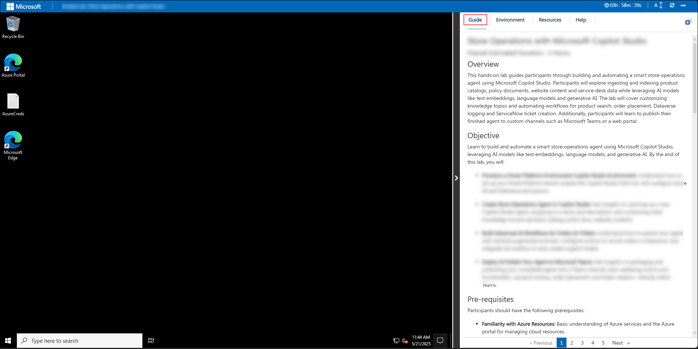
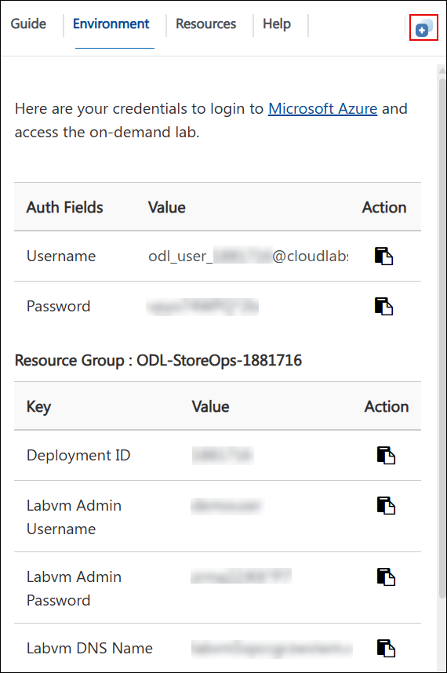
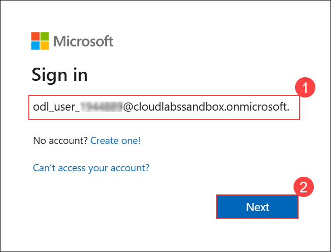

## Getting Started with Challenge

We've prepared a seamless environment for you to explore and learn. Let's begin by making the most of this experience.

### Accessing Your Challenge Environment

Once you're ready to dive in, your virtual machine and challenge guide will be right at your fingertips within your web browser.



### Exploring Your Challenge Resources

To get a better understanding of your challenge resources and credentials, navigate to the Environment tab.


### Utilizing the Split Window Feature

For convenience, you can open the challenge guide in a separate window by selecting the Split Window button from the Top right corner.



### Managing Your Virtual Machine

Feel free to start, stop, or restart your virtual machine as needed from the Resources tab. Your experience is in your hands!


> **Note:** If the VM is not in use, please **deallocate** it to avoid unnecessary resource consumption.

---

## Let's Get Started with Microsoft Azure

1. In the JumpVM, click on the **Azure Portal** browser shortcut on the desktop.

   

1. On the **Sign into Microsoft** tab, enter the provided email and click **Next**.

   - Email/Username: <inject key="AzureAdUserEmail"></inject>

     

1. Enter the following Temporary Access Pass and click **Sign in**.

   - Temporary Access Pass: <inject key="AzureAdUserPassword"></inject>

     

1. If prompted with **Stay Signed in?**, click **No**.

   

---

## Download the Challenge Data Files

Three reference files have been prepared for this challenge. Download all three now before you begin.

1. Download the supplier quote document:

   ```
   https://raw.githubusercontent.com/CloudLabsAI-Azure/zavashop-supplier-assistant/datasets/data/supplier-quote.md
   ```

1. Download the product catalog reference:

   ```
   https://raw.githubusercontent.com/CloudLabsAI-Azure/zavashop-supplier-assistant/datasets/data/product-catalog.csv
   ```

1. Download the supplier history reference:

   ```
   https://raw.githubusercontent.com/CloudLabsAI-Azure/zavashop-supplier-assistant/datasets/data/supplier-history.md
   ```

   Save all three files to your Desktop or a folder you can find quickly. You will use them in both phases of the challenge.

---

## Verify Access to Required Services

1. Navigate to **Microsoft Foundry**:

   ```
   https://ai.azure.com
   ```

   Sign in and confirm the pre-provisioned Foundry hub and project are visible under your subscription.

1. In the Azure Portal, confirm the following resources exist in your assigned resource group:

   - Azure AI Search instance
   - Microsoft Foundry hub

   > **Note:** If either resource is missing, navigate to the Environment tab and contact CloudLabs support before proceeding.

---

Now, click on the **Next** from the lower right corner to move on to the challenge.

## Happy Hacking!!
